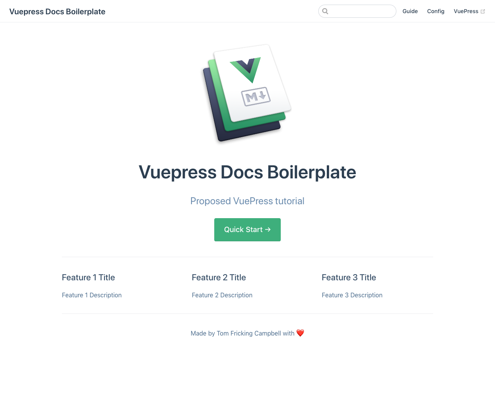

# VuePress default theme tutorial: creating your home page

VuePress lets you focus on writing content without spending much time on 
the mechanics. In return you get a beautiful-looking site with
excellent performance, a clean and functional layout, and header-based
search.

This tutorial shows how to create a documentation site. You'll need to
be willing to drop into your Windows or Bash terminal, and to create
text files.

## Create the directory structure for your VuePress site

Create the full directory structure and change to the root directory of your project.

* If you're using Windows Powershell, create the directory tree like this. **Replace mydocsite with the name of the directory you plan to create.**

```powershell
# Create the directory structure
mkdir $env:userprofile/html/mydocsite/docs/.vuepress/public
# Change to the project directory
cd $env:userprofile/html/mydocsite
```

If you're using MacOS or Linux, create the directory tree like this. **Replace mydocsite with the name of the directory you plan to create.**

```bash
# Create the directory structure
# -p allows you to create a full directory tree
$ mkdir -p ~/html/mydocsite/docs/.vuepress/public
# Change to the project directory
$ cd ~/html/mydocsite
```

## Run yarn create vuepress

Let's start a wizard that lets you create an example site with a few files illustrating VuePress in action.

```
yarn create vuepress
```

### Answer questions from the wizard

You'll see a lot of output in the console, and then you'll be asked some questions. Here's an example.

* When asked `Select the boilerplate type`, **be sure to choose docs** for this example.

This will create a VuePress site in the `/docs` directory of your project, which is appropriate 
when you're creating technical documentation.

* When asked `What’s the name of your project?` you can put the GitHub repo name if you want, 
say `mydocsite` and **not** `github.com/mygithubid/mydocsite`.

* When asked `What’s the description of the project?`, choose a brief tagline you'd like to appear on your home page.

* When asked `What’s your email?`, answer with the email you use for project development. 

You can enter something fake for the example.

* When asked `What’s your name?` answer with something the public can see, because it's displayed 
on the home page footer along with an emoji heart.

* When asked `What's the repo of your project?`, enter something like `https://github/mygithubid`, 
where you would replace `mygithubid` with your GitHub ID. The project name will be appended to this
in `package.json`.

You'll then see the site get generated:

```
create package.json
create .gitignore
create docs/.vuepress/components/demo-component.vue
create docs/.vuepress/components/Foo/Bar.vue
create docs/.vuepress/components/OtherComponent.vue
create docs/.vuepress/config.js
create docs/.vuepress/enhanceApp.js
create docs/.vuepress/styles/index.styl
create docs/.vuepress/styles/palette.styl
create docs/config/README.md
create docs/guide/README.md
create docs/guide/using-vue.md
create docs/README.md
create README.md
```

## Run vuepress to see the site

We're about to run vuepress in development mode, which renders a site 
to HTML and Javascript, then runs a local server so you can view the results.
You'll be able to start another terminal instance, make changes while this
server runs, and see changes instantly.

A quick reminder. Your site is created in the `/docs` directory of your VuePress project. 
Because of that you'll append that directory name to the `dev` command.

* Run `vuepress dev docs` at the command line:

```
vuepress dev docs
```

## View the site

You're told to visit [http://localhost:8080/](http://localhost:8080/), 
so click the link or paste that address into your browser. Here's what you should see:



Next: [Create and link to more pages](create-and-link.md)
